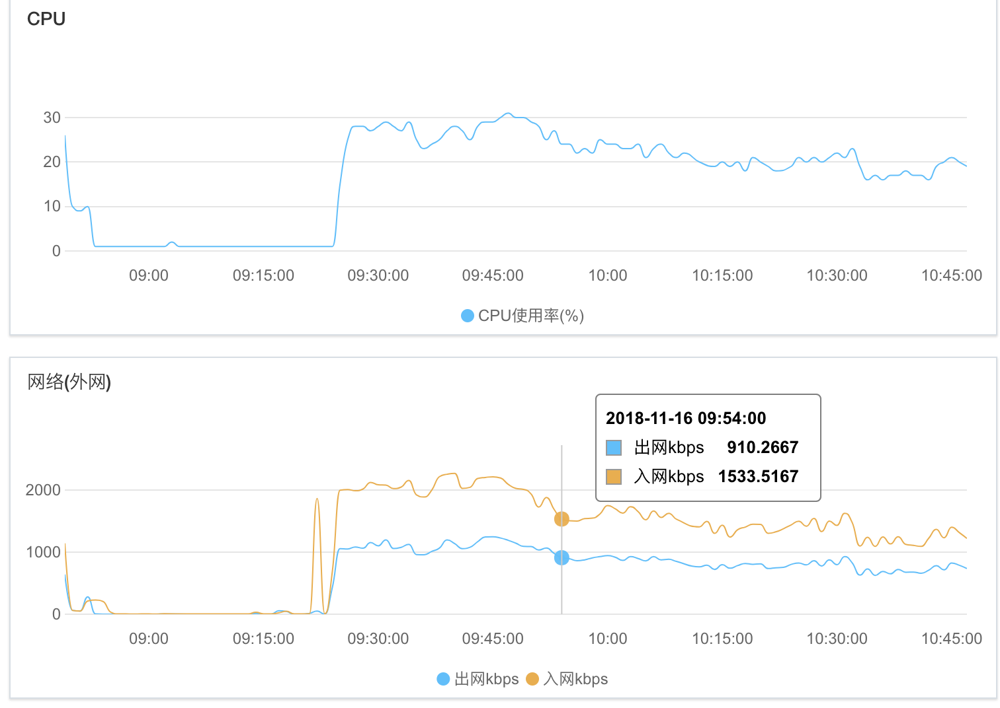

# Overall

This is a simple crawler design for [bilibili](www.bilibili.com) that can collect basic data associate with each video. For example, it will collect the number of `comment`, `dannmaku`, `coin` of each video.

# Performance
After tuning parameters in configuration file and run it in my server, it can collect approximately 300k video data per hour. However, this number is trivial compared with the total video number in [bilibili](www.bilibili.com). By the time 2018/11/14, the max `av` number is larger than 35 million, which means it will cost this program several days to collect all video data, hopefully.

### Bottleneck

The speed of Internet. 

As you can see, outward internet flow reaches upper limit as soon as I running this program

# How to run it

### Database

create databsase and tables with the following command

`mysql> source table.sql`

### Configuration file

rename `config-default.json` to `config.json` and edit it.

### Proxy

If you want to use proxy, change `GetProxy()` function in `proxy/proxy.go` to provide your proxy ip addresses. **The quality of your proxy server has a great influence on the overall performance**

### Compile codes

`go build`

### Start running it!

`./bilibiliCrawler [-v[d] startAid endAid][-o[d]][-b[d]]`

# Tuning parameters in configuration file

### maxCrawlerNum

This parameter determine the max number of crawler go routines. Although a go routine is much lighter than a thread, this number cannot be **too large**. Because the bottleneck is the speed of internet. In my server, `300` seems reasonable. 

### retryTimes

This parameter determine the max number a go routine failed to crawl a video data until it gives up. It highly depends on your internet reliability and your proxy server's reliability if you choose to use proxy. No one knows why some data isn't properly transmitted. If you're not confident with your internet, try a higher value. In my case, I use `10`, `20` or even `30`.

### maxOpenConn

This parameter determine the max number of connection that mysql connection pool holds. Mysql server limits the number of connection to `100` by default, so I set this parameter to `95` in case some emergency may occur.

# Explanation of Data Field

// TODO

# Summary

A crawler program is actually pretty simple, however, when requiring the program running several hours or even forever; it indeed becomes difficult. A simple bug may not matter for a small program running a few seconds, but is fatal to a long-staying service program. It took me 4 days finally fix all bugs. In this process, I met lots of strange bugs that I even never think about. Some relate to `mysql`, some relate to network knowledge. Here I want to explain the most challenging bug in detail. 

### Memory leak bug

After I finish main part of my crawler, I run it in my server. A strange situation occurred. After running smoothly for several hours, my program cashes suddenly. I checked `mysql` error log and my crawler's error log, but found nothing. I took me a whole day to realize that it results from **memory leaking**. After several hours running my program, my program occupied almost all available memory. Then linux system kill this process because of running out of memory, this mechanism also referred as `OOM Killer` or `Out Of Memory Killer`. The following link explains the detail of this leak and how to fix it.

[Closing HTTP Response Body](http://devs.cloudimmunity.com/gotchas-and-common-mistakes-in-go-golang/index.html#close_http_resp_body)

[Closing HTTP Connections](http://devs.cloudimmunity.com/gotchas-and-common-mistakes-in-go-golang/index.html#close_http_conn)