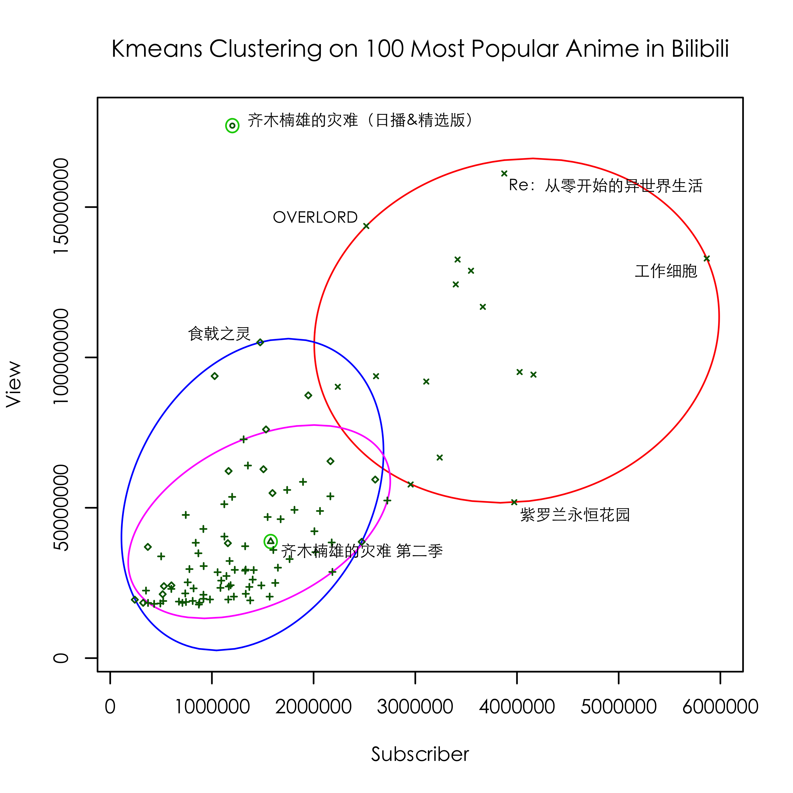
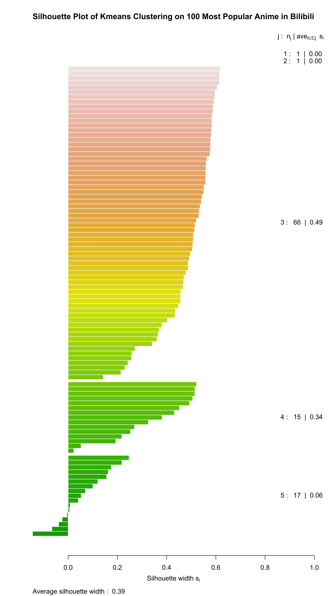

# Abstract

In this paper, I analyzed data collected from Bilibili, which is the most popular online entertainment website in China. By visualizing data and running clustering algorithm, some interesting results pop up. I use `Golang` to implement a crawler with high concurrency supported to collect data, and `R` takes over the analyzing and visualizing part of it.

# Introduction

An era of rapid economic growth in China with the boom of internet gave rise to a new generation - Generation Z, people who born between 1990 and 2009. Like no other generation before, they grow up in affluent times and are internet-savvy consumers and trend-setters. They are transforming online entertainment in China. Born to address their demand, Bilibili is the welcoming home of diverse culture and interests and represents the iconic brand for online entertainment serving young generations in China. Started as a content community inspired by anime, comics and games, Bilibili has evolved into a full-spectrum online entertainment world with 72 million and growing monthly-active-users, over 80% of whom are Generation z. Bilibili created an immersive entertainment experience for Generation Z, and built highly sticky and engaged communities. Their pioneered community feature - bullet chatting - transforms viewing experience by allowing audience to share thoughts and feelings real-time with others viewing the same video. They also created a unique membership exam, leading to users' strong sense of belonging. As a result, their users spend approximately 76 minutes daily on Bilibili. Their dynamic communities fuel on ever-growing supply of creative professional user generated content, and content creators earn respect and rewards from our users, forming a self-reinforcing virtuous cycle. By analyzing the data collected from it, I believe it's a good way to learn about the Generation Z.

# Part 1: Daily Active User in Bilibili

`./bilibiliCrawler -o[d]`

Using the above command, a crawler will be initiated to collect active user number of Bilibili every minute. For detail codes, see `crawler/online.go`

As demonstrated in the above figures, Bilibili holds a highly active user group with incredible loyalty. There're millions of users browsing their website every time even if it's in midnight. And as the red line showed, there're more than 50 thousands new video uploaded everyday, making this community lively and creatively.

# Part 2: Clustering Analyzing of Anime

### Data Collection

`./bilibiliCrawler -b[d]`

Using the above command, over 2000 anime data will be collect from Bilibili. For detail codes, see `crawler/bangumi.go`. If everything's fine, it will only cost you several minutes.

In this section, only the following field will be used.

| Field | Explanation | 
| --- | --- |
| title | name/identifier of the anime | 
| subscriber | the number of subscriber of the anime | 
| view | the number of times that the anime is played (sum of all episodes) |
| view1 | the number of times that the first episode of the anime is played |
| view3 | the number of times that the third episode of the anime is played |
| view1n | the number of times that the last episode of the anime is played |
| view3n | the number of times that the third last episode of the anime is played |

The view of first episode of an anime may just depends on the publicity and how popular of this intellectual property is. So it may just demonstrate people's  expectation and be irrelevant to the actual performance of it. However, the view of third episode may largely relative with the actual quality of this anime. In this sense, by comparing the difference between `view1` and `view3`, I can find whether people is satisfied with it. The view of the third last episode may related with the equality of the entirely anime, and the view of the last episode may related with the quality of ending of this anime. I choose this four field in order to provide information in more dimension, so that my analysis will be more comprehensive and accurate.

### Data Preprocessing

In the rest of this section, all relative codes are stored in file `visual/bangumiClustering.R`.

I chose a subset of all anime to conduct this analysis, namely, 100 most popular anime were used as dataset after removing invalid ones. Here I decided to use the number of times that the anime is played as criteria to determine which one is more popular, since people is generally more familiar with those anime, hence, the result will be more intuitive. 

Also, I use normalization to eliminate the influence caused by the order of magnitudes of different field. 

To be more specific, `view` and `subscriber` are normalized across **all anime** analyzed. The following codes does the job.

~~~R
# bangumi is anime in Japanese. 
# I use it just because it appears more interesting to me.
bangumi.data <- scale(bangumi.data)
~~~

`view1`, `view2`, `view1n` and `view3n` are a little different. They are normalized across **all episode** of a specific anime. The following codes does the job.

~~~R
epdata <- scale(epdata)
~~~

So after preprocessing, data should be like this.

| title | subscriber | view | view1 | view3 | view1n | view3n |
| --- | --- | --- | --- | --- | --- | --- |
| 齐木楠雄的灾难（日播&精选版）| 0.1411795 | 4.794045 | 7.441913 | 1.752764427 | -0.8288319 | -1.5574569 |
| Re：从零开始的异世界生活 | 3.1416083 | 4.276249 | 4.478053 | 0.222903397 | -0.2814297 | -0.6988199 |
| OVERLORD | 1.6189524 | 3.708043 | 3.054340 | 0.008884399 | 0.7177556 | -0.3164916 |
| OVERLORDⅡ | 2.6265758 | 3.344890 | 3.069243 | -0.528246750 | 0.7596778 | -0.5551935 |
| 工作细胞 | 5.3756598 | 3.356346 | 2.836749 | 0.419733939 | -0.9962491 | -0.6214508 |
| OVERLORD Ⅲ | 2.6063785 | 3.075571 | 3.227855 | -0.116261306 | -0.8443022 | -0.4561667 |
| 在下坂本，有何贵干？ | 2.7746897 | 3.223651 | 2.899112 | 0.320569318 | -1.1089019 | -0.5597468 |
| 小林家的龙女仆 | 2.9048504 | 2.832698 | 2.608638 | 0.548210997 | -0.9330176 | -0.6030295 |
| 食戟之灵 | 0.4486281 | 2.448500 | 4.422652 | 0.479730450 | 0.2280054 | -0.4721607 |
| Fate/Apocrypha | 2.2809767 | 2.024209 | 4.294462 | 0.699122367 | -0.4251027 | -0.5924514 |

### Hierarchical Clustering

Hierarchical cluster analysis using a set of dissimilarities for the n objects being clustered. In this case, a dissimilarity matrix based on euclidean distance is computed. Initially, each anime is assigned to its own cluster and then the algorithm proceeds iteratively, at each stage joining the two most similar clusters, continuing until there is just a single cluster. At each stage distances between clusters are recomputed by the Lance–Williams dissimilarity update formula according to the particular clustering method being used.

~~~R
bangumi.dist <- dist(bangumi.data[1:number.hc.datasize,])
bangumi.hc <- hclust(bangumi.dist)
~~~

The above figure demonstrates the clustering result on 50 most popular anime. Here I choose a dataset of size 50 instead of 100 for better clearity.

Each colorful rectangle box in the figure identify a cluster after I divided them into 7 clusters based on their height in this hierarchical tree. One of the most  unique characteristics of this algorithm that differentiate it from other clustering algorithm is that there may exist a bunch of clusters that contain only one data in it. This behavior could be advantage or disadvantage depends on the structure of your input data. In your input dataset, if there're some data that significant different from others, namely outliers, the hierarchical clustering can easily identify them and it will not affect the clustering result of other data. Otherwise this behavior will cause some redundant clusters and make result not clear and convincing enough.

### Kmeans Clustering

This algorithm first randomly choose k points as initial k center points. Then it runs iteratively. Within each iteration, it first assign each non-center points to a cluster depends on which center point it closes to. In this process, distance formula, usually is euclidean distance, is used to evaluate closeness. Then it shifts the center point of each cluster to the average point of all points belong to it. After center points no longer changes, the result converges and it stop iterating.

~~~R
bangumi.kmeans <- kmeans(bangumi.data[1:number.kmeans.datasize,], 
						number.kmeans.cluster, nstart=50)
~~~

Each cluster is represented by the ellipse with smallest area containing all its points. (This is a special case of the minimum volume ellipsoid.) The ellipses are colored with respect to their density, which is the number of points in the cluster divided by the area of the ellipse. With increasing density, the colors are light blue, light green, red and purple.

As showed in the figure above, data was divided into 5 cluster. However, two of which contains only a single data point. This is the intrinsic characteristic of this algorithm. Since the shifting of center points are calculated by the average distance, it's easy to be influenced by some extreme value. Such point can distort the distribution of data significantly. So the best solution for this algorithm is to divided this extreme value point into a cluster alone. Also the choice of initial center points can affect the result greatly, rendering this algorithm somehow unstable.

### PAM Clustering

The pam-algorithm is based on the search for k representative objects or medoids among the observations of the dataset. These observations should represent the structure of the data. After finding a set of k medoids, k clusters are constructed by assigning each observation to the nearest medoid. The goal is to find k representative objects which minimize the sum of the dissimilarities of the observations to their closest representative object. 
By default, when medoids are not specified, the algorithm first looks for a good initial set of medoids (this is called the build phase). Then it finds a local minimum for the objective function, that is, a solution such that there is no single switch of an observation with a medoid that will decrease the objective (this is called the swap phase). The detail procedure can be summarized as follows:

1. Initialize: select k of the n data points as the medoids
2. Associate each data point to the closest medoid.
3. While the cost of the configuration decreases:
	1. For each medoid m, for each non-medoid data point o:
		1. Swap m and o, associate each data point to the closest medoid, recompute the cost (sum of distances of points to their medoid)
		2. If the total cost of the configuration increased in the previous step, undo the swap

Compared to the k-means approach, this algorithm is more robust because in the swap phase, the swapping process guarantee the center point of each cluster is an actual data point, which will alleviate negative effects caused by extreme points.

As shown in the figure above, `齐木楠雄的灾难（日播&精选版）` and `齐木楠雄的灾难 第二季` no longer belongs to a cluster alone, rendering the result more clearly demonstrate the difference between clusters when the total number of cluster is fixed.

### Compare Kmeans and PAM with Respect to Silhouette Plot

The silhouette value is a measure of how similar an object is to its own cluster (cohesion) compared to other clusters (separation). The silhouette ranges from −1 to +1, where a high value indicates that the object is well matched to its own cluster and poorly matched to neighboring clusters. If most objects have a high value, then the clustering configuration is appropriate. If many points have a low or negative value, then the clustering configuration may have too many or too few clusters.

For each observation i, the silhouette width s(i) is defined as follows: 

Put a(i) = average dissimilarity between i and all other points of the cluster to which i belongs (if i is the only observation in its cluster, s(i) := 0 without further calculations). For all other clusters C, put d(i,C) = average dissimilarity of i to all observations of C. The smallest of these d(i,C) is b(i), and can be seen as the dissimilarity between i and its “neighbor” cluster, i.e., the nearest one to which it does not belong. 

Finally, `s(i) := ( b(i) - a(i) ) / max( a(i), b(i) )`

Since the PAM algorithm will not let extreme points to belong to a cluster alone, the average within-cluster distance actually increases. This phenomenon reflects in the two silhouette plot showed above. The average silhouette width of PAM is actually smaller than Kmeans.

# Part 3: Visualizing over 35000000 Video Data in Bilibili

# Reference

1. [bilibili上市宣传视频](www.bilibili/video/av21322566)